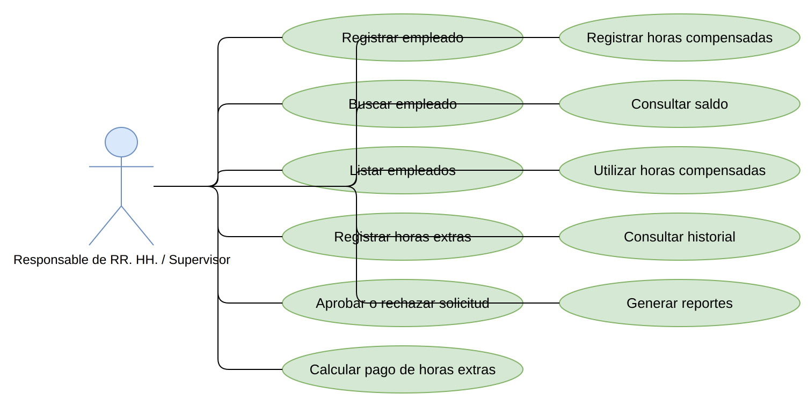
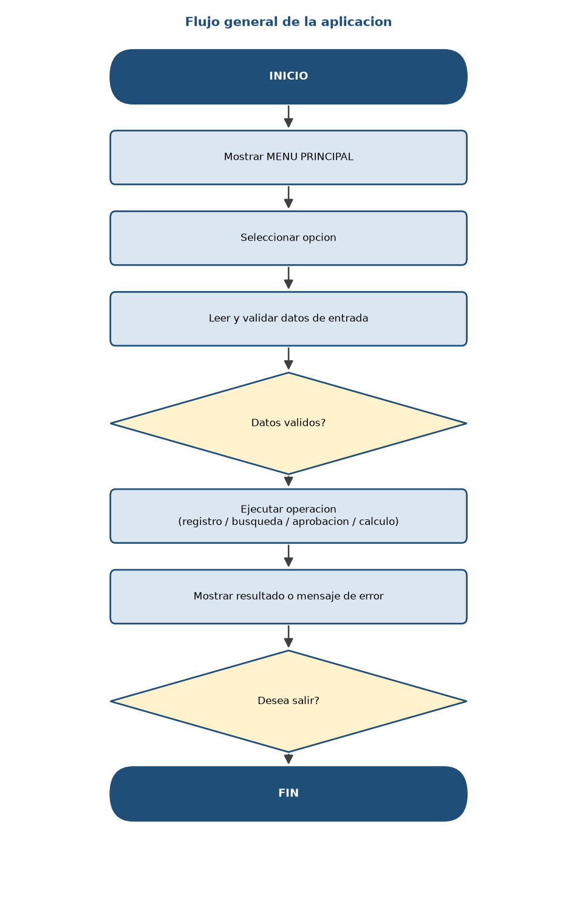
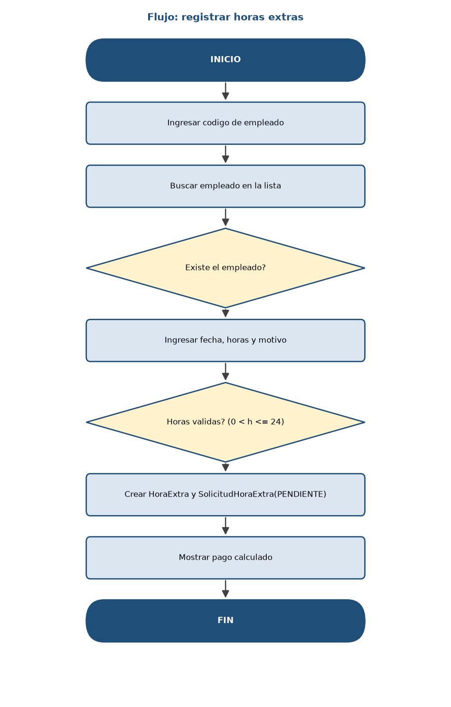
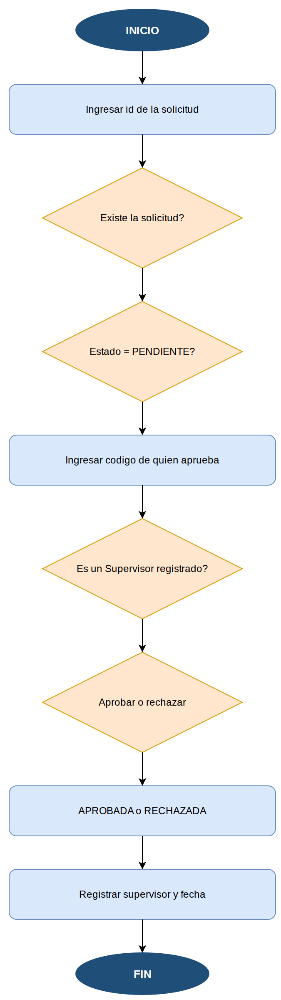
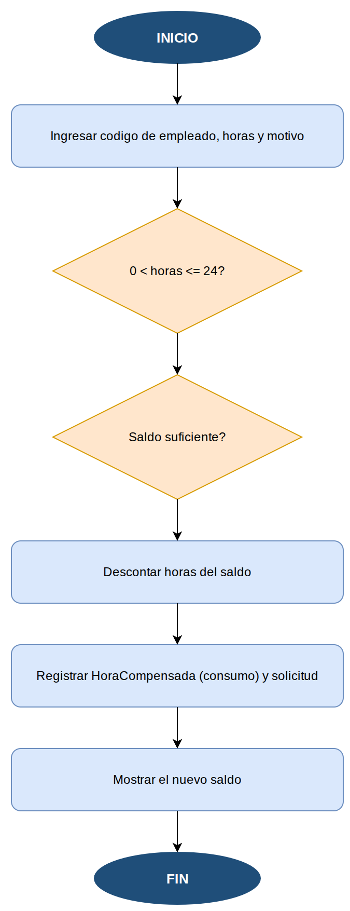
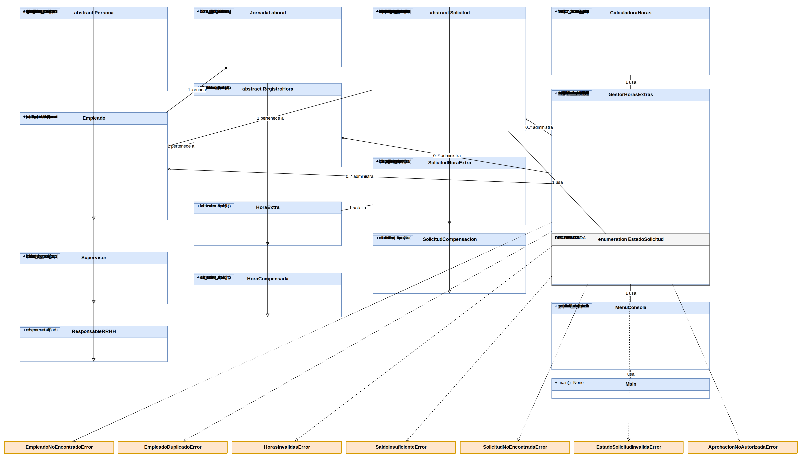

# Sistema de Gestión y Control de Horas Extras y Horas Compensadas

**Trabajo Parcial — Fundamentos de Programación 2**

---

# A. CARÁTULA / MIEMBROS DEL GRUPO

<br>

<div align="center">


**Universidad Peruana de Ciencias Aplicadas (UPC)**

Ingeniería de Sistemas EPE

<br><br>

**Curso:**
1FIS275 — Fundamentos de Programación 2

**Trabajo Parcial**

<br>

**"Sistema de Gestión y Control de Horas Extras y Horas Compensadas"**

<br><br>

**Integrantes:**

[INTEGRANTE 1]
[INTEGRANTE 2]
[INTEGRANTE 3]
[INTEGRANTE 4]

<br>

**Docente:**
[DOCENTE]

**Ciclo:**
2026-25

</div>

<br><br>

---

# B. ÍNDICE

1. Introducción
2. Capítulo 1: Situación Actual
   - 2.1 Análisis del Problema
   - 2.2 Objetivo del Sistema
   - 2.3 Lista de Funcionalidades / Historias de Usuario, priorizadas
   - 2.4 Cronograma y Asignación de Actividades
3. Capítulo 2: Propuesta de Innovación
   - 3.1 Diseño de Flujo de Aplicación
   - 3.2 Diagrama de Clases del Modelo
4. Bibliografía
5. Anexos

---

# C. INTRODUCCIÓN

El presente trabajo se desarrolla en el marco del curso Fundamentos de
Programación 2 de Ingeniería de Sistemas EPE. El objetivo es resolver, con un
programa orientado a objetos, un problema real identificado en un proceso de
negocio de una empresa.

El problema elegido pertenece al área de Recursos Humanos. En [NOMBRE DE LA
EMPRESA], el control de las horas que los empleados trabajan fuera de su
jornada habitual y de las horas que luego se compensan se realizaba de forma
manual: formularios en papel, planillas de cálculo aisladas y un cuaderno para
llevar el saldo de horas compensadas. Esa forma de trabajo generaba retrasos,
errores al transcribir los datos y discrepancias entre lo que el empleado
reportaba, lo que el supervisor aprobaba y lo que finalmente se pagaba o
compensaba.

Frente a esta situación, se propone el **Sistema de Gestión y Control de Horas
Extras y Horas Compensadas**, una aplicación de consola desarrollada en Python
que centraliza el registro de empleados, el registro y la aprobación de horas
extras, el cálculo del pago, el control del saldo de horas compensadas y la
generación de reportes. El alcance del sistema es académico: trabaja en memoria
(sin base de datos), no incluye interfaz gráfica ni integración con otros
sistemas, y las reglas de cálculo son configurables por el equipo.

La solución se construyó aplicando los conceptos del curso: clases y objetos,
encapsulamiento, herencia, polimorfismo, colecciones tipo lista, manejo de
excepciones y pruebas de los métodos de negocio con `unittest`. El resultado es
un programa de 14 clases principales que se ejecuta desde un menú de consola y
que puede explicarse y defenderse con claridad.

---

# D. CAPÍTULO 1: SITUACIÓN ACTUAL

## 2.1 Análisis del Problema

### Situación actual

El proceso de control de horas se realizaba en tres pasos que no estaban
conectados entre sí:

1. El empleado llenaba un formulario en papel cuando hacía horas extras y lo
   dejaba en su escritorio hasta fin de mes.
2. El supervisor recogía los formularios y anotaba en una planilla si los
   aprobaba o rechazaba.
3. El área de Recursos Humanos consolidaba la planilla, calculaba con
   calculadora lo que se debía pagar y llevaba por separado un cuaderno con las
   horas compensadas.

### Problema

La empresa no cuenta con una herramienta única que permita registrar,
controlar, aprobar y calcular de manera uniforme las horas extras ni las horas
compensadas de sus empleados.

### Causas

| # | Causa |
|---|-------|
| C1 | El registro se hace en papel y se centraliza a fin de mes. |
| C2 | No existe un repositorio común entre el área usuaria y Recursos Humanos. |
| C3 | Los cálculos del valor hora y del pago se hacen de forma manual. |
| C4 | El control de horas compensadas es un cuaderno físico. |
| C5 | Las solicitudes no tienen un estado formal (pendiente, aprobada, rechazada). |

### Consecuencias

| # | Consecuencia |
|---|--------------|
| CO1 | Errores frecuentes al transcribir los formularios a la planilla. |
| CO2 | Retrasos en el pago de las horas extras. |
| CO3 | Conflictos entre el empleado y la empresa por horas no reconocidas. |
| CO4 | Saldo de horas compensadas desactualizado o inexistente. |
| CO5 | Imposibilidad de auditar cuántas horas extras se han pagado en el mes. |

### Necesidad

Se requiere una aplicación de consola en Python que centralice el registro, la
aprobación, el cálculo y el reporte de las horas extras y compensadas, y que
mantenga un saldo confiable por empleado.

## 2.2 Objetivo del Sistema

### Objetivo general

Desarrollar una aplicación de consola en Python que gestione y controle las
horas extras y las horas compensadas de los empleados de [NOMBRE DE LA
EMPRESA], permitiendo el registro, la aprobación, el cálculo de pago, el
control de saldo y la generación de reportes.

### Objetivos específicos

| # | Objetivo específico |
|---|---------------------|
| OE1 | Registrar y mantener actualizados los datos de los empleados. |
| OE2 | Registrar solicitudes de horas extras con fecha, cantidad de horas y motivo. |
| OE3 | Aprobar o rechazar solicitudes con un estado formal. |
| OE4 | Calcular automáticamente el valor hora y el pago de las horas extras aprobadas. |
| OE5 | Registrar horas compensadas y mantener un saldo actualizado por empleado. |
| OE6 | Permitir utilizar horas compensadas respetando el saldo disponible. |
| OE7 | Generar reportes de empleados, horas extras, solicitudes pendientes y saldos. |
| OE8 | Controlar los datos de entrada con validaciones y excepciones personalizadas. |

## 2.3 Lista de Funcionalidades / Historias de Usuario, priorizadas

| ID | Historia de Usuario | Prioridad |
|----|---------------------|-----------|
| HU01 | Registrar empleado | Alta |
| HU02 | Buscar empleado | Media |
| HU03 | Listar empleados | Media |
| HU04 | Registrar horas extras | Alta |
| HU05 | Consultar solicitudes | Alta |
| HU06 | Aprobar horas extras | Alta |
| HU07 | Rechazar horas extras | Alta |
| HU08 | Calcular pago de horas extras | Alta |
| HU09 | Registrar horas compensadas | Alta |
| HU10 | Consultar saldo | Alta |
| HU11 | Utilizar horas compensadas | Alta |
| HU12 | Consultar historial | Media |
| HU13 | Generar reportes | Media |

El detalle de cada historia (criterios de aceptación y método del programa que
la implementa) está en `docs/03_historias_usuario.md`.

## 2.4 Cronograma y Asignación de Actividades

El trabajo se organizó por semanas del ciclo 2026-25. La evaluación del trabajo
parcial corresponde a la semana 4. Las actividades se distribuyeron entre los
cuatro integrantes.

| # | Actividad | Responsable | Inicio | Fin | Estado |
|---|-----------|-------------|--------|-----|--------|
| 1 | Análisis del enunciado y de los requisitos | Integrante 1 | 31/08/2026 | 02/09/2026 | Completado |
| 2 | Definición del problema real y del objetivo | Integrante 2 | 02/09/2026 | 04/09/2026 | Completado |
| 3 | Historias de usuario y priorización | Integrante 3 | 04/09/2026 | 07/09/2026 | Completado |
| 4 | Diseño de flujos de la aplicación | Integrante 2 | 07/09/2026 | 10/09/2026 | Completado |
| 5 | Diseño de clases, herencia y polimorfismo | Integrante 1 | 08/09/2026 | 12/09/2026 | Completado |
| 6 | Diagrama de clases UML | Integrante 3 | 12/09/2026 | 15/09/2026 | Completado |
| 7 | Implementación de las clases del modelo | Integrante 4 | 12/09/2026 | 18/09/2026 | Completado |
| 8 | Implementación de cálculos, excepciones y menú | Integrante 1 | 15/09/2026 | 21/09/2026 | Completado |
| 9 | Pruebas unitarias con unittest | Integrante 4 | 18/09/2026 | 22/09/2026 | Completado |
| 10 | Corrección de errores y reejecución de pruebas | Integrante 2 | 22/09/2026 | 23/09/2026 | Completado |
| 11 | Revisión del UML contra el código | Integrante 3 | 23/09/2026 | 24/09/2026 | Completado |
| 12 | Elaboración del informe y anexos | Integrante 4 | 23/09/2026 | 26/09/2026 | Completado |
| 13 | Revisión final contra la rúbrica | Integrante 1 | 26/09/2026 | 26/09/2026 | Completado |

Herramienta de gestión: Trello (ver Anexo 8).

---

# E. CAPÍTULO 2: PROPUESTA DE INNOVACIÓN

## 3.1 Diseño de Flujo de Aplicación

El sistema se organiza alrededor de un menú de consola que se repite hasta que
el usuario elige salir. Ante cualquier dato inválido, el programa muestra el
error y vuelve al menú, sin cerrarse.

### Diagrama de casos de uso



### Flujo general



### Flujo de registro de horas extras



### Flujo de aprobación o rechazo



### Flujo de utilización de horas compensadas



Los diagramas editables están en `uml/flujo_aplicacion.puml`,
`uml/flujo_registro_horas_extras.puml`, `uml/flujo_aprobacion.puml` y
`uml/flujo_horas_compensadas.puml`.

## 3.2 Diagrama de Clases del Modelo



El diagrama editable está en `uml/diagrama_clases.puml`.

### Encapsulamiento

Los atributos se guardan con la convención de variable privada (`_nombre`) y
se accede a ellos mediante propiedades (`@property`) con validación en el
setter. Las listas del gestor se entregan como copias, de modo que no puedan
modificarse desde fuera de la clase.

### Herencia

El sistema tiene tres jerarquías:

```
Persona (abstracta)  →  Empleado  →  Supervisor
                                  →  ResponsableRRHH

RegistroHora (abstracta)  →  HoraExtra
                          →  HoraCompensada

Solicitud (abstracta)  →  SolicitudHoraExtra
                       →  SolicitudCompensacion
```

`Persona` agrupa los datos de identificación; `RegistroHora` agrupa id,
empleado, fecha, horas y motivo; y `Solicitud` agrupa el ciclo de vida común de
una solicitud. Cada subclase agrega solo lo que le es propio.

### Polimorfismo

El polimorfismo se ejecuta a través de referencias de la clase padre:

- `RegistroHora.calcular_valor()`: en `HoraExtra` devuelve
  `valor_hora × factor_recargo × horas`; en `HoraCompensada` devuelve
  `valor_hora × horas`. En los reportes se recorre `list[RegistroHora]` y se
  invoca `calcular_valor()` sin conocer el tipo concreto.
- `Solicitud.calcular_monto()`: en `SolicitudHoraExtra` delega en su
  `HoraExtra`; en `SolicitudCompensacion` aplica `valor_hora × cantidad_horas`.
- `Persona.obtener_rol()`: devuelve "Empleado", "Supervisor" o "Responsable de
  RR.HH." según la subclase; se usa para filtrar por rol sin `isinstance`.

### Relaciones entre clases

- **Composición:** `Empleado` está compuesto por una `JornadaLaboral` (1 a 1).
- **Agregación:** `GestorHorasExtras` administra `list[Empleado]`,
  `list[RegistroHora]` y `list[Solicitud]` (1 a 0..*).
- **Asociación:** cada `RegistroHora` y cada `Solicitud` pertenece a un
  `Empleado`; cada `SolicitudHoraExtra` referencia una `HoraExtra`.
- **Dependencia:** `GestorHorasExtras` usa `CalculadoraHoras` y lanza las
  excepciones de negocio; `MenuConsola` usa `GestorHorasExtras`.

### Colecciones

Se utilizan tres listas:

| Colección | Uso |
|-----------|-----|
| `list[Empleado]` | Registro, búsqueda y listado de empleados. |
| `list[RegistroHora]` | Movimientos de horas y cálculo de totales. |
| `list[Solicitud]` | Estados, aprobación, pago y reportes. |

### Cálculos principales

```
valor_hora       = salario_mensual / horas_mensuales        (por defecto 240 h)
valor_hora_extra = valor_hora × factor_hora_extra           (por defecto 1.5)
pago_total       = valor_hora_extra × cantidad_horas
valor_compensada = valor_hora × cantidad_horas
saldo_nuevo      = saldo − horas_utilizadas   (si horas_utilizadas ≤ saldo)
```

> El factor 1.5 no proviene de una norma legal: es una regla configurada para
> este trabajo académico y puede modificarse con `CalculadoraHoras.factor_hora_extra`.

### Excepciones

Seis excepciones propias controlan los errores de negocio:
`EmpleadoNoEncontradoError`, `EmpleadoDuplicadoError`, `HorasInvalidasError`,
`SaldoInsuficienteError`, `SolicitudNoEncontradaError` y
`EstadoSolicitudInvalidaError`. Para los datos simples (texto vacío, salario
negativo) se usa `ValueError`. El menú captura todas ellas y continúa
funcionando.

---

# F. BIBLIOGRAFÍA

American Psychological Association. (2020). *Publication manual of the American
Psychological Association* (7.ª ed.). https://doi.org/10.1037/0000165-000

Lutz, M. (2013). *Learning Python* (5.ª ed.). O'Reilly Media.

Python Software Foundation. (2024). *The Python standard library*.
https://docs.python.org/3/library/

Python Software Foundation. (2024). *The Python tutorial*.
https://docs.python.org/3/tutorial/

Python Software Foundation. (2024). *unittest — Unit testing framework*.
https://docs.python.org/3/library/unittest.html

PlantUML. (2024). *PlantUML language reference guide*. https://plantuml.com/guide

Sommerville, I. (2016). *Software engineering* (10.ª ed.). Pearson.

Van Rossum, G., Warsaw, B., & Coghlan, N. (2001). *PEP 8 — Style guide for
Python code*. Python Software Foundation.
https://peps.python.org/pep-0008/

---

# G. ANEXOS

## ANEXO 1 — Evidencias del trabajo en equipo

[INSERTAR CAPTURA]

Coordinaciones realizadas por cada integrante (reuniones, acuerdos y
distribución de tareas).

## ANEXO 2 — Evidencias de desarrollo

[INSERTAR CAPTURA]

Capturas de la ejecución del programa y de las pruebas unitarias
(ver también `salida/pruebas_unittest.txt`).

## ANEXO 3 — Capturas del sistema

[INSERTAR CAPTURA]

Capturas del menú principal, del registro de empleados, del registro de horas
extras, de la aprobación de solicitudes y de los reportes. La salida completa
de una ejecución real está en `salida/ejecucion_menu.txt`.

## ANEXO 4 — Pruebas

[INSERTAR CAPTURA]

Resultado de la ejecución con `unittest`: 21 pruebas ejecutadas, 21 correctas,
0 fallidas. Detalle en `docs/07_pruebas.md`.

## ANEXO 5 — UML

[INSERTAR CAPTURA]

Diagrama de clases en `uml/diagrama_clases.puml` e imagen en
`salida/diagrama_clases.png`.

## ANEXO 6 — Flujo

[INSERTAR CAPTURA]

Diagramas de flujo en `uml/` e imágenes en `salida/`.

## ANEXO 7 — Git

[INSERTAR URL DE GIT]

URL del repositorio con los *commits* por rol de todo el equipo.

## ANEXO 8 — Trello

[INSERTAR URL DE TRELLO]

Tablero de gestión del cronograma y de las actividades del equipo.
