# Sistema de Gestión y Control de Horas Extras y Horas Compensadas

**Trabajo Parcial — Fundamentos de Programación 2**

---

# A. CARÁTULA / MIEMBROS DEL GRUPO

<br>

<div align="center">


**Universidad Peruana de Ciencias Aplicadas (UPC)**

Ingeniería de Sistemas EPE

<br><br>

**Curso:**
1FIS275 — Fundamentos de Programación 2

**Trabajo Parcial**

<br>

**"Sistema de Gestión y Control de Horas Extras y Horas Compensadas"**

<br><br>

**Integrantes:**

Marlon James Castro Castro
Fatima Auris Aliaga
Victor Hugo López Sobrado


<br>

**Docente:**
Chahuas Rebatta, César Eduardo

**Ciclo:**
2026-25

</div>

<br><br>

---

# B. ÍNDICE

1. Introducción … 3
2. Capítulo 1: Situación Actual … 4
   - 2.1 Análisis del Problema … 4
   - 2.2 Objetivo del Sistema … 5
   - 2.3 Lista de Funcionalidades / Historias de Usuario, priorizadas … 5
   - 2.4 Cronograma y Asignación de Actividades … 5
3. Capítulo 2: Propuesta de Innovación … 7
   - 3.1 Diseño de Flujo de Aplicación … 7
   - 3.2 Diagrama de Clases del Modelo … 13
4. Bibliografía … 15
5. Anexos … 16

---

# C. INTRODUCCIÓN

El presente trabajo se desarrolla en el marco del curso Fundamentos de
Programación 2 de Ingeniería de Sistemas EPE y tiene como finalidad aplicar
los principios de la programación orientada a objetos para plantear una
solución a un problema real identificado en un proceso de negocio de una
empresa.

El problema seleccionado corresponde al proceso de gestión y control de horas
extras y horas compensadas. Actualmente, el registro de estas horas se realiza
mediante cuadernos y archivos Excel, generando duplicidad de información
debido a que los datos registrados por los trabajadores deben ser
posteriormente trasladados a un medio digital. Esta situación puede ocasionar
errores en el registro, dificultades para realizar el seguimiento de las
solicitudes y demoras en su revisión, aprobación y posterior procesamiento.

Ante esta situación, se propone desarrollar un Sistema de Gestión y Control de
Horas Extras y Horas Compensadas, como una aplicación de consola desarrollada
en Python. El sistema permitirá registrar trabajadores y sus horas, gestionar
la aprobación o rechazo por parte del responsable del área, controlar el saldo
de horas compensadas, realizar los cálculos correspondientes y consultar el
historial de registros.

La solución será desarrollada aplicando conceptos de programación orientada a
objetos, tales como clases, objetos, encapsulamiento, herencia y polimorfismo,
además del uso de colecciones, manejo de excepciones y pruebas de los métodos
de negocio. El sistema tendrá un alcance académico y trabajará con información
almacenada en memoria, sin integración con una base de datos o sistemas
externos.

---

# D. CAPÍTULO 1: SITUACIÓN ACTUAL

## 2.1 Análisis del Problema

### Situación actual

Actualmente, el proceso de gestión de horas extras y horas compensadas se
realiza mediante el registro de información en cuadernos y archivos Excel. El
trabajador registra las horas realizadas en un cuaderno y posteriormente esta
información es trasladada a un archivo Excel para su control.

Una vez registrada la información, el responsable del área revisa las horas
reportadas y determina su aprobación o rechazo. En el caso de las horas extras
aprobadas, posteriormente se realiza el cálculo correspondiente para su
procesamiento. Por otro lado, las horas compensadas requieren llevar un
control del saldo disponible de cada trabajador y de las horas utilizadas.

Este proceso implica el manejo de información en diferentes medios y el
traslado manual de datos, lo que puede generar errores de registro, duplicidad
de información, dificultades para consultar el estado de las solicitudes y
falta de un control centralizado del saldo de horas compensadas.

### Problema

La empresa no cuenta con una herramienta única que permita registrar,
controlar, aprobar y calcular de manera uniforme las horas extras ni las horas
compensadas de sus empleados.

### Causas

| # | Causa |
|---|-------|
| C1 | El registro se hace en papel y se centraliza a fin de mes. |
| C2 | No existe un repositorio común entre el área usuaria y Recursos Humanos. |
| C3 | Los cálculos del valor hora y del pago se hacen de forma manual. |
| C4 | El control de horas compensadas es un cuaderno físico. |
| C5 | Las solicitudes no tienen un estado formal (pendiente, aprobada, rechazada). |

### Consecuencias

| # | Consecuencia |
|---|--------------|
| CO1 | Errores frecuentes al transcribir los formularios a la planilla. |
| CO2 | Retrasos en el pago de las horas extras. |
| CO3 | Conflictos entre el empleado y la empresa por horas no reconocidas. |
| CO4 | Saldo de horas compensadas desactualizado o inexistente. |
| CO5 | Imposibilidad de auditar cuántas horas extras se han pagado en el mes. |

### Necesidad

Se requiere una aplicación de consola en Python que centralice el registro, la
aprobación, el cálculo y el reporte de las horas extras y compensadas, y que
mantenga un saldo confiable por empleado.

## 2.2 Objetivo del Sistema

### Objetivo general

Desarrollar una aplicación de consola en Python que permita gestionar y
controlar las horas extras y horas compensadas de los empleados de Fábrica
Marsar SRL, mediante el registro de horas, la revisión y aprobación por parte
del responsable del área, el cálculo de las horas extras y el control del
saldo de horas compensadas.

### Objetivos específicos

| # | Objetivo específico |
|---|---------------------|
| OE1 | Registrar y mantener actualizados los datos de los empleados. |
| OE2 | Registrar solicitudes de horas extras con fecha, cantidad de horas y motivo. |
| OE3 | Permitir al responsable del área revisar, aprobar o rechazar los registros de horas extras. |
| OE4 | Calcular el valor correspondiente a las horas extras aprobadas de acuerdo con las reglas definidas para el sistema. |
| OE5 | Registrar las horas compensadas y mantener actualizado el saldo disponible de cada empleado. |
| OE6 | Permitir la utilización de horas compensadas, validando que el empleado cuente con saldo suficiente. |
| OE7 | Permitir la consulta de empleados, solicitudes, estados, historial y saldos de horas. |
| OE8 | Validar los datos ingresados y controlar las situaciones no válidas mediante el manejo de excepciones. |

## 2.3 Lista de Funcionalidades / Historias de Usuario, priorizadas

| ID | Historia de Usuario | Prioridad |
|----|---------------------|-----------|
| HU01 | Registrar empleado | Alta |
| HU02 | Buscar empleado | Media |
| HU03 | Listar empleados | Media |
| HU04 | Registrar horas extras | Alta |
| HU05 | Consultar solicitudes | Alta |
| HU06 | Aprobar solicitud de horas extras | Alta |
| HU07 | Rechazar solicitud de horas extras | Alta |
| HU08 | Calcular pago de horas extras aprobadas | Alta |
| HU09 | Registrar horas compensadas | Alta |
| HU10 | Consultar saldo de horas compensadas | Alta |
| HU11 | Utilizar horas compensadas | Alta |
| HU12 | Consultar historial | Media |
| HU13 | Generar reportes | Media |

El detalle de cada historia (criterios de aceptación y método del programa que
la implementa) está en `docs/03_historias_usuario.md`.

## 2.4 Cronograma y Asignación de Actividades

El trabajo se organizó por semanas del ciclo 2026-25. La evaluación del trabajo
parcial corresponde a la semana 4. Las actividades se distribuyeron entre los
tres integrantes.

| # | Actividad | Responsable | Inicio | Fin | Estado |
|---|-----------|-------------|--------|-----|--------|
| 1 | Análisis del enunciado y de los requisitos | Integrante 1 | 31/08/2026 | 02/09/2026 | Completado |
| 2 | Definición del problema real y del objetivo | Integrante 2 | 02/09/2026 | 04/09/2026 | Completado |
| 3 | Historias de usuario y priorización | Integrante 3 | 04/09/2026 | 07/09/2026 | Completado |
| 4 | Diseño de flujos de la aplicación | Integrante 2 | 07/09/2026 | 10/09/2026 | Completado |
| 5 | Diseño de clases, herencia y polimorfismo | Integrante 1 | 08/09/2026 | 12/09/2026 | Completado |
| 6 | Diagrama de clases UML | Integrante 3 | 12/09/2026 | 15/09/2026 | Completado |
| 7 | Implementación de las clases del modelo | Integrante 3 | 12/09/2026 | 18/09/2026 | Completado |
| 8 | Implementación de cálculos, excepciones y menú | Integrante 1 | 15/09/2026 | 21/09/2026 | Completado |
| 9 | Pruebas unitarias con unittest | Integrante 2 | 18/09/2026 | 22/09/2026 | Completado |
| 10 | Corrección de errores y reejecución de pruebas | Integrante 2 | 22/09/2026 | 23/09/2026 | Completado |
| 11 | Revisión del UML contra el código | Integrante 3 | 23/09/2026 | 24/09/2026 | Completado |
| 12 | Elaboración del informe y anexos | Integrante 1 | 23/09/2026 | 26/09/2026 | Completado |
| 13 | Revisión final contra la rúbrica | Integrante 1 | 26/09/2026 | 26/09/2026 | Completado |

Herramienta de gestión: Trello (ver Anexo 8).

---

# E. CAPÍTULO 2: PROPUESTA DE INNOVACIÓN

## 3.1 Diseño de Flujo de Aplicación

El sistema se organiza alrededor de un menú de consola que se repite hasta que
el usuario elige salir. Ante cualquier dato inválido, el programa muestra el
error y vuelve al menú, sin cerrarse.

### Diagrama de casos de uso


### Flujo general


### Flujo de registro de horas extras


### Flujo de aprobación o rechazo


### Flujo de utilización de horas compensadas


Los diagramas editables están en `drawio/flujo_aplicacion.drawio`,
`drawio/flujo_registro_horas_extras.drawio`, `drawio/flujo_aprobacion.drawio` y
`drawio/flujo_horas_compensadas.drawio` (formato draw.io).

## 3.2 Diagrama de Clases del Modelo


El diagrama editable está en `drawio/diagrama_clases.drawio`.

### Encapsulamiento

Los atributos se guardan con la convención de variable privada (`_nombre`) y
se accede a ellos mediante propiedades (`@property`) con validación en el
setter. Las listas del gestor se entregan como copias, de modo que no puedan
modificarse desde fuera de la clase.

### Herencia

El sistema tiene tres jerarquías:

```
Persona (abstracta)  →  Empleado  →  Supervisor
                                  →  ResponsableRRHH

RegistroHora (abstracta)  →  HoraExtra
                          →  HoraCompensada

Solicitud (abstracta)  →  SolicitudHoraExtra
                       →  SolicitudCompensacion
```

`Persona` agrupa los datos de identificación; `RegistroHora` agrupa id,
empleado, fecha, horas y motivo; y `Solicitud` agrupa el ciclo de vida común de
una solicitud. Cada subclase agrega solo lo que le es propio.

### Polimorfismo

El polimorfismo se ejecuta a través de referencias de la clase padre:

- `RegistroHora.calcular_valor()`: en `HoraExtra` devuelve
  `valor_hora × factor_recargo × horas`; en `HoraCompensada` devuelve
  `valor_hora × horas`. En los reportes se recorre `list[RegistroHora]` y se
  invoca `calcular_valor()` sin conocer el tipo concreto.
- `Solicitud.calcular_monto()`: en `SolicitudHoraExtra` delega en su
  `HoraExtra`; en `SolicitudCompensacion` aplica `valor_hora × cantidad_horas`.
- `Persona.obtener_rol()`: devuelve "Empleado", "Supervisor" o "Responsable de
  RR.HH." según la subclase; se usa para filtrar por rol sin `isinstance`.

### Relaciones entre clases

- **Composición:** `Empleado` está compuesto por una `JornadaLaboral` (1 a 1).
- **Agregación:** `GestorHorasExtras` administra `list[Empleado]`,
  `list[RegistroHora]` y `list[Solicitud]` (1 a 0..*).
- **Asociación:** cada `RegistroHora` y cada `Solicitud` pertenece a un
  `Empleado`; cada `SolicitudHoraExtra` referencia una `HoraExtra`.
- **Dependencia:** `GestorHorasExtras` usa `CalculadoraHoras` y lanza las
  excepciones de negocio; `MenuConsola` usa `GestorHorasExtras`.

### Colecciones

Se utilizan tres listas:

| Colección | Uso |
|-----------|-----|
| `list[Empleado]` | Registro, búsqueda y listado de empleados. |
| `list[RegistroHora]` | Movimientos de horas y cálculo de totales. |
| `list[Solicitud]` | Estados, aprobación, pago y reportes. |

### Cálculos principales

```
valor_hora       = salario_mensual / horas_mensuales        (por defecto 240 h)
valor_hora_extra = valor_hora × factor_hora_extra           (por defecto 1.5)
pago_total       = valor_hora_extra × cantidad_horas
valor_compensada = valor_hora × cantidad_horas
saldo_nuevo      = saldo − horas_utilizadas   (si horas_utilizadas ≤ saldo)
```

> El factor 1.5 no proviene de una norma legal: es una regla configurada para
> este trabajo académico y puede modificarse con `CalculadoraHoras.factor_hora_extra`.

### Excepciones

Siete excepciones propias controlan los errores de negocio:
`EmpleadoNoEncontradoError`, `EmpleadoDuplicadoError`, `HorasInvalidasError`,
`SaldoInsuficienteError`, `SolicitudNoEncontradaError`,
`EstadoSolicitudInvalidaError` y `AprobacionNoAutorizadaError`. Esta última
aplica la regla de que **solo un supervisor registrado puede aprobar o
rechazar** una solicitud: el gestor busca al empleado que intenta aprobar y, si
no es supervisor, rechaza la operación. Para los datos simples (texto vacío,
salario negativo) se usa `ValueError`. El menú captura todas ellas y continúa
funcionando.

---

# F. BIBLIOGRAFÍA

American Psychological Association. (2020). *Publication manual of the American
Psychological Association* (7.ª ed.). https://doi.org/10.1037/0000165-000

Lutz, M. (2013). *Learning Python* (5.ª ed.). O'Reilly Media.

Python Software Foundation. (2024). *The Python standard library*.
https://docs.python.org/3/library/

Python Software Foundation. (2024). *The Python tutorial*.
https://docs.python.org/3/tutorial/

Python Software Foundation. (2024). *unittest — Unit testing framework*.
https://docs.python.org/3/library/unittest.html

PlantUML. (2024). *PlantUML language reference guide*. https://plantuml.com/guide

Sommerville, I. (2016). *Software engineering* (10.ª ed.). Pearson.

Van Rossum, G., Warsaw, B., & Coghlan, N. (2001). *PEP 8 — Style guide for
Python code*. Python Software Foundation.
https://peps.python.org/pep-0008/

---

# G. ANEXOS

## ANEXO 1 — Evidencias del trabajo en equipo

Coordinaciones realizadas por cada integrante (reuniones, acuerdos y
distribución de tareas). Los números de teléfono de los participantes se
difuminaron en las capturas del grupo.

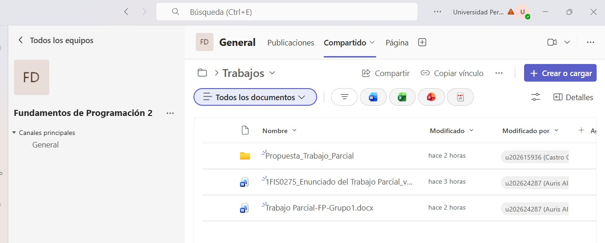

*Figura 8. Carpeta compartida en Google Drive con el enunciado, la propuesta y el documento del equipo*

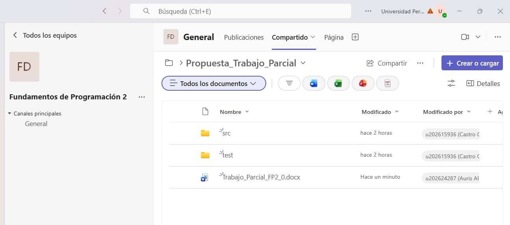

*Figura 9. Carpeta de Drive con la estructura de carpetas del proyecto y el documento del trabajo parcial*

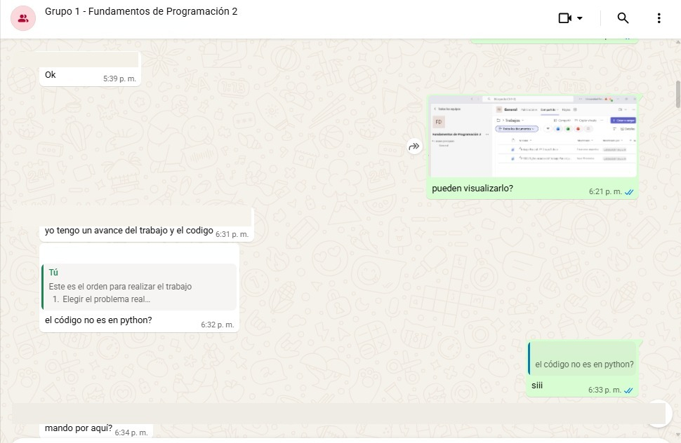

*Figura 10. Acuerdo sobre el problema real y sobre el lenguaje de programación del curso*

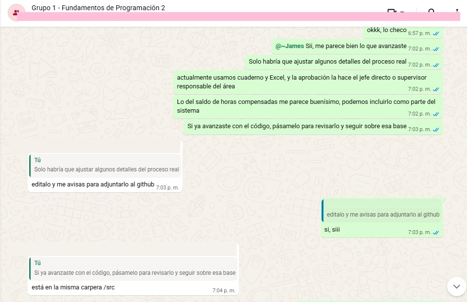

*Figura 11. Ajuste del proceso real: registro en cuaderno y Excel, y aprobación a cargo del responsable del área*

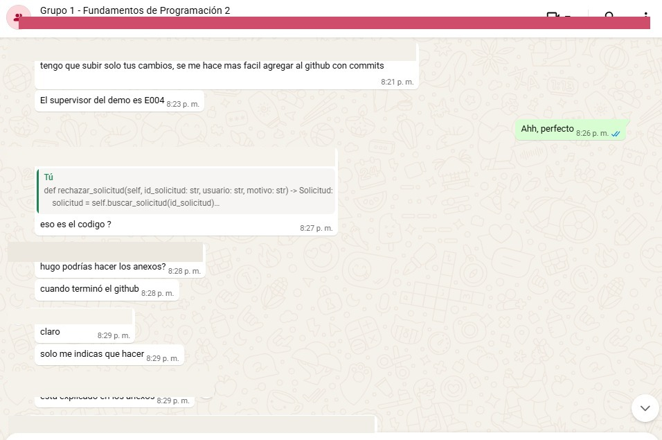

*Figura 12. Revisión del código del sistema y distribución de los anexos entre los integrantes*

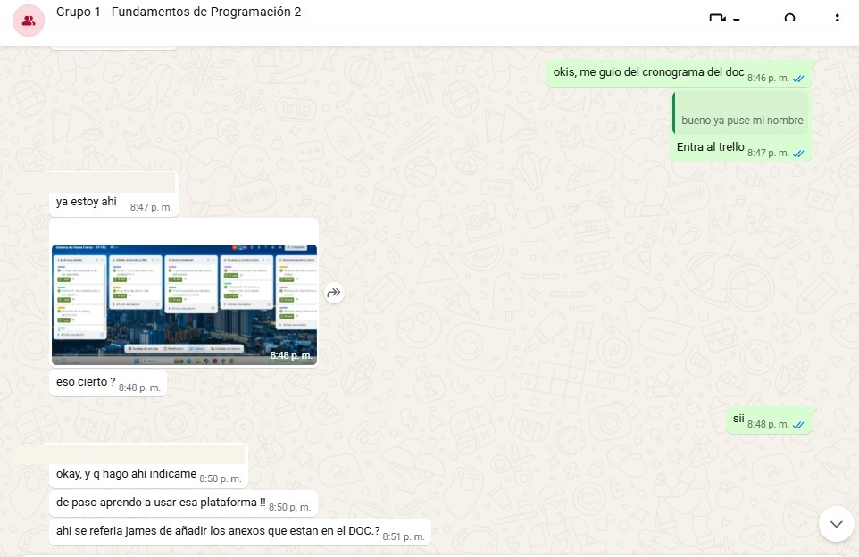

*Figura 13. Organización del trabajo en el tablero de Trello a partir del cronograma del documento*

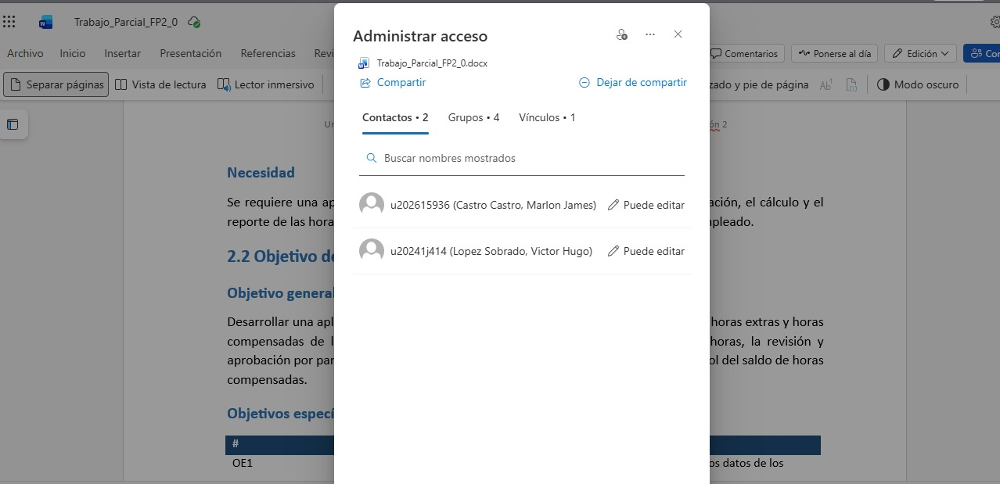

*Figura 14. Permisos de edición del documento compartido para los tres integrantes del equipo*

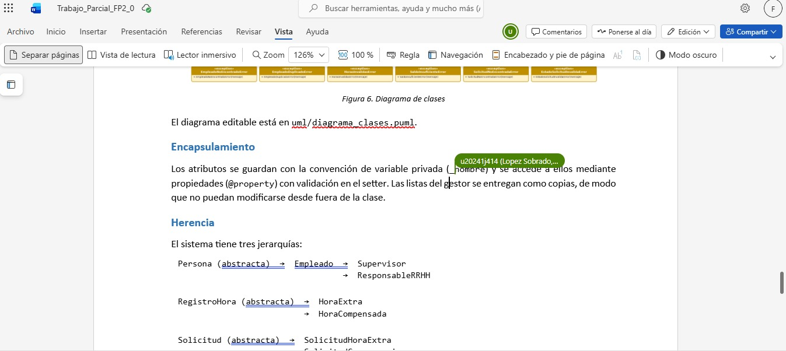

*Figura 15. Documento del trabajo parcial con el diagrama de clases y los comentarios de revisión*

## ANEXO 2 — Evidencias de desarrollo

Capturas del código fuente y de la comparación de versiones durante el
desarrollo, junto con la ejecución del programa
(ver también `salida/pruebas_unittest.txt`).

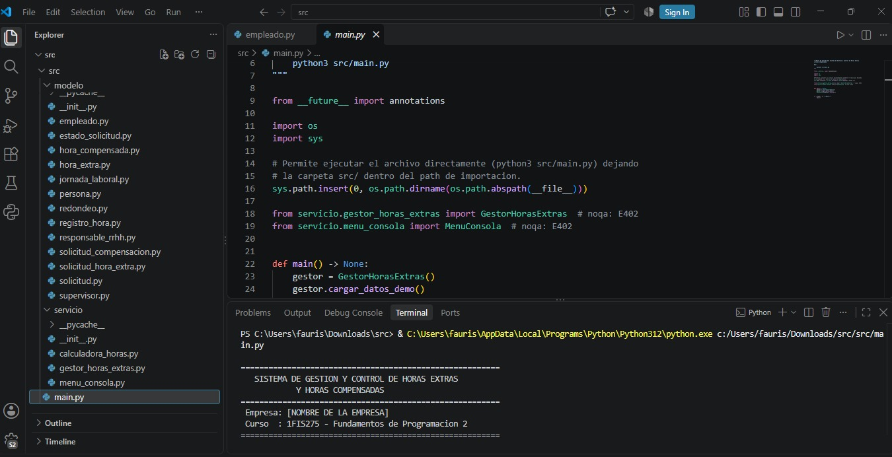

*Figura 16. Estructura del proyecto y punto de entrada `src/main.py`*

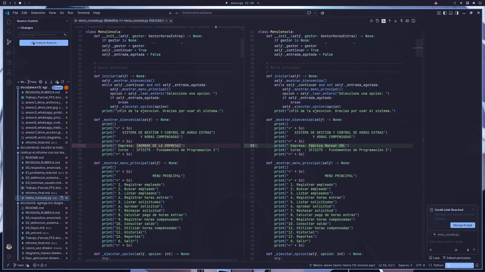

*Figura 17. Comparación de cambios entre dos versiones de `menu_consola.py`*

## ANEXO 3 — Capturas del sistema

Capturas del menú principal, del registro de empleados, del registro de horas
extras, de la aprobación de solicitudes y de los reportes. La salida completa
de una ejecución real está en `salida/ejecucion_menu.txt`.

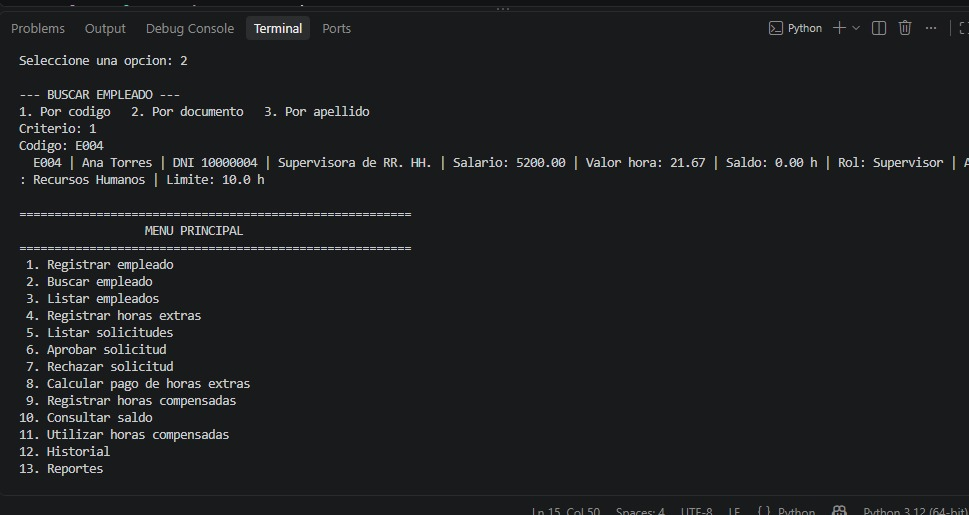

*Figura 18. Menú principal y búsqueda de empleado por código (EG04, Ana Torres)*

## ANEXO 4 — Pruebas

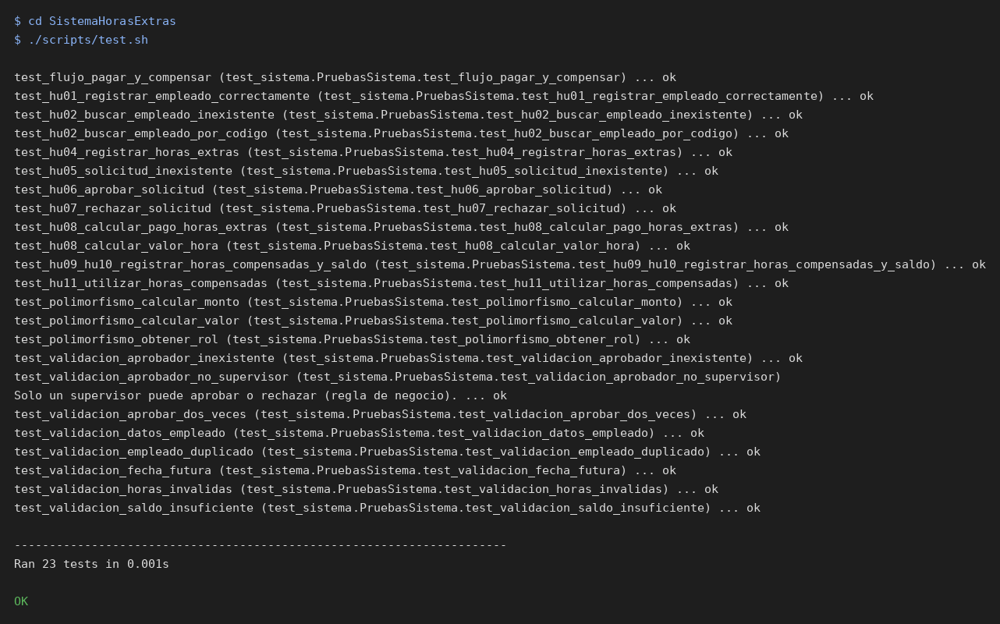

*Figura 19. Salida de la ejecución de las pruebas unitarias (unittest)*

Resultado de la ejecución con `unittest`: 23 pruebas ejecutadas, 23 correctas,
0 fallidas. Detalle en `docs/07_pruebas.md`.

## ANEXO 5 — UML

Diagrama de clases en `drawio/diagrama_clases.drawio` e imagen en
`salida/diagrama_clases.png`.


*Figura 20. Diagrama de clases del modelo (véase también la Figura 6)*

## ANEXO 6 — Flujo

Los cuatro diagramas de flujo se muestran en las Figuras 2 a 5 del capítulo 2.
Los archivos editables están en `/drawio` y las imágenes en `/salida` del
repositorio *github*.

## ANEXO 7 — Git

https://github.com/marlo4220mc/sistema-horas-extras

Repositorio público con los *commits* del equipo (historia por etapas).

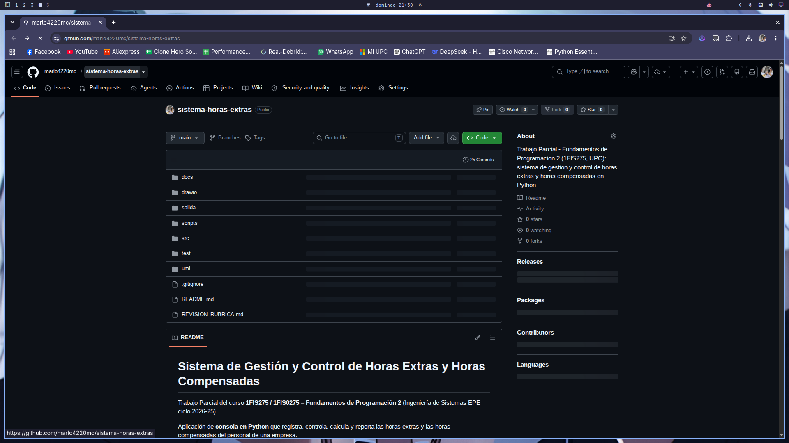

*Figura 21. Repositorio del equipo en GitHub con el historial de commits*

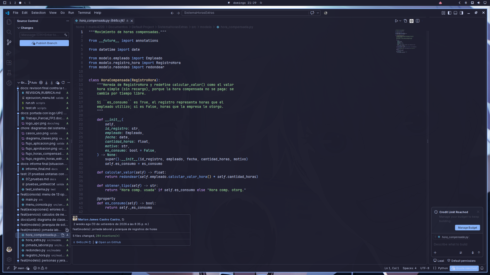

*Figura 22. Historial de versiones del archivo `hora_compensada.py`*

## ANEXO 8 — Trello

Tablero de gestión del cronograma y de las actividades del equipo:

https://trello.com/b/VRlZeBkn/sistema-de-horas-extras-tp-fp2

El tablero tiene 5 listas (una por fase del proyecto) y 13 tarjetas, una por
actividad del cronograma, con el responsable, las fechas y el estado.

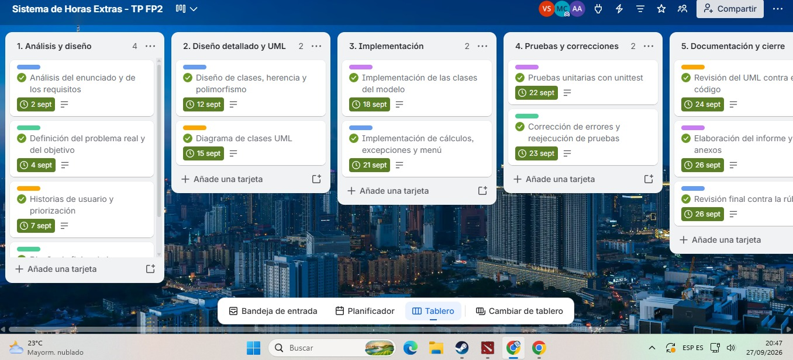

*Figura 23. Tablero de Trello con el cronograma y la asignación de actividades*
